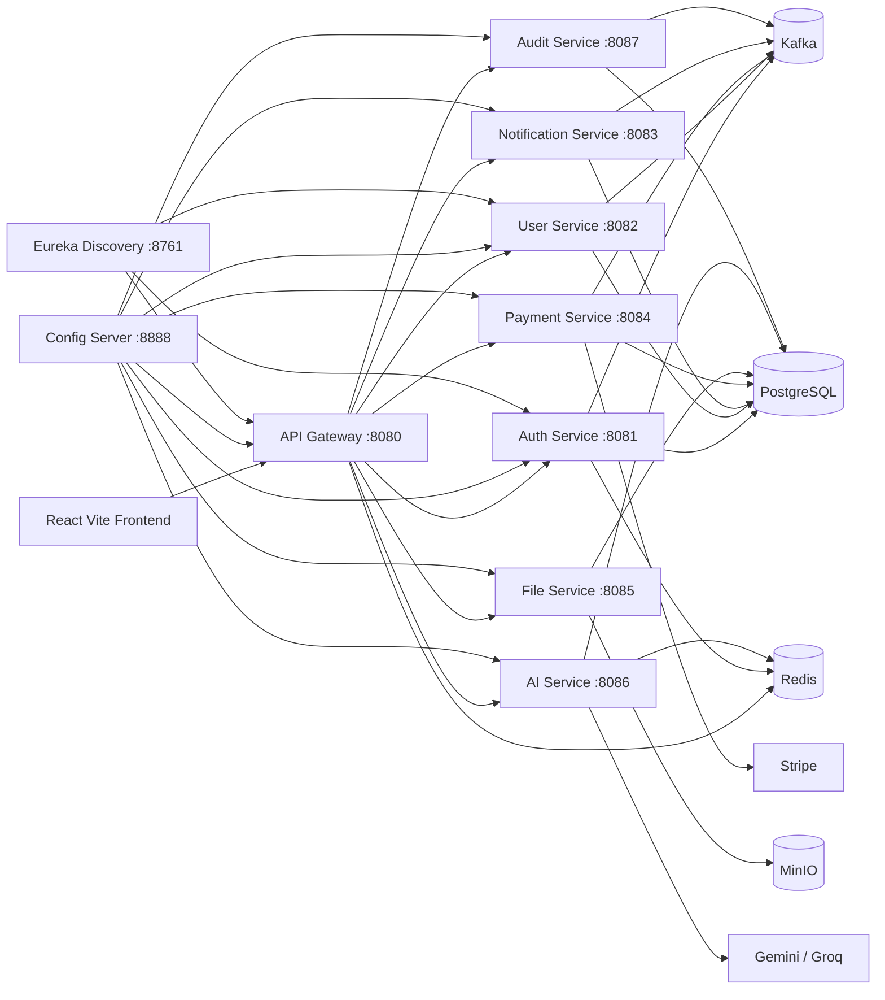

# Microservice Industry Platform

A production-ready starter platform for building industry-level microservice applications with a Spring Boot backend, React frontend, Dockerized infrastructure, centralized configuration, service discovery, async messaging, observability, authentication, file storage, payments, and AI chat.

This repository is designed as a reusable foundation: clone it, configure the environment, run the full stack locally, and then build domain-specific services on top of the existing platform patterns.

## Table of Contents

- [What This Project Includes](#what-this-project-includes)
- [Architecture](#architecture)
- [Tech Stack](#tech-stack)
- [Repository Structure](#repository-structure)
- [Prerequisites](#prerequisites)
- [Environment Setup](#environment-setup)
- [Run Application With Docker Compose](#run-application-with-docker-compose)
- [Run Frontend Locally](#run-frontend-locally)
- [Run Backend Locally](#run-backend-locally)
- [Service Ports](#service-ports)
- [Frontend Details](#frontend-details)
- [Backend Details](#backend-details)
- [API Overview](#api-overview)
- [API Testing Guide](#api-testing-guide)
- [Infrastructure And Observability](#infrastructure-and-observability)
- [Database And Migrations](#database-and-migrations)
- [Deployment Notes](#deployment-notes)
- [Useful Commands](#useful-commands)
- [Troubleshooting](#troubleshooting)


## What This Project Includes

- React 18 + Vite frontend with authentication flows, protected routes, dashboard pages, file management, payments, AI chat, notifications, profile, sessions, and admin screens.
- Java 21 + Spring Boot 3.4 microservice backend with a Maven multi-module build.
- Spring Cloud Gateway as the single backend entrypoint.
- Spring Cloud Config Server for centralized service configuration.
- Eureka Discovery Server for service registration and discovery.
- PostgreSQL databases split per service.
- Redis for caching, sessions, rate limiting, and fast shared state.
- Kafka for asynchronous service events.
- MinIO for object storage.
- MailHog/Brevo-ready email flow.
- Stripe-ready payment service.
- Gemini/Groq-ready AI service.
- Prometheus, Grafana, Zipkin, and Actuator metrics for observability.
- Docker Compose for local and production-style runs.
- Kubernetes base manifests and overlays for dev, staging, and production.
- Terraform and Helm placeholders for infrastructure evolution.

## Architecture



The browser talks to the backend through the API Gateway. The gateway routes `/api/v1/...` requests to individual services. Shared DTOs, events, utilities, and API response objects live in `backend/commons`.

## Tech Stack

| Layer | Technology |
| --- | --- |
| Frontend | React 18, Vite 6, Tailwind CSS, React Router, TanStack Query, Zustand, Axios |
| Backend | Java 21, Spring Boot 3.4.5, Spring Cloud 2024.0.1, Maven |
| Gateway | Spring Cloud Gateway, JWT validation, CORS, filters, rate-limit support |
| Auth | Spring Security, OAuth2, JWT, refresh token cookies, email verification |
| Data | PostgreSQL, Hibernate DDL, Spring Data JPA |
| Cache / Sessions | Redis |
| Messaging | Kafka KRaft |
| Storage | MinIO |
| AI | Gemini and Groq provider adapters |
| Payments | Stripe-ready payment service |
| Observability | Spring Actuator, Prometheus, Grafana, Zipkin, Micrometer |
| Deployment | Docker Compose, Netlify, Render/Railway configs, Kubernetes manifests |

## Repository Structure

```text
.
|-- frontend/                         # React + Vite app
|   |-- src/api/                       # Axios instance, interceptors, endpoint map
|   |-- src/components/                # Layout, common UI, notifications
|   |-- src/config/                    # Frontend environment config
|   |-- src/hooks/                     # Auth, pagination, permissions, SSE hooks
|   |-- src/pages/                     # App pages and auth pages
|   `-- package.json
|-- backend/
|   |-- api-gateway/                   # Spring Cloud Gateway
|   |-- auth-service/                  # Signup, login, OAuth, sessions, JWT, profile auth
|   |-- user-service/                  # User profile, roles, preferences, admin users
|   |-- notification-service/          # Notifications and SSE stream
|   |-- payment-service/               # Payment creation, confirmation, webhooks
|   |-- file-service/                  # File metadata, upload, download URL, MinIO integration
|   |-- ai-service/                    # AI chat, sessions, streaming, usage
|   |-- audit-service/                 # Audit logs and export
|   |-- config-server/                 # Spring Cloud Config Server
|   |-- config-server-repo/            # Local config repository templates
|   |-- discovery-server/              # Eureka server
|   |-- commons/                       # Shared DTOs, entities, events, utilities
|   |-- docs/                          # Architecture, API contracts, ADRs
|   |-- infrastructure/                # PostgreSQL init, Prometheus, Grafana, Terraform, Helm
|   `-- k8s/                           # Kubernetes base and overlays
|-- docker-compose.yml                 # Full local stack definition
|-- docker-compose.override.yml        # Local overrides
|-- docker-compose.prod.yml            # Production-style backend compose
|-- Dockerfile                         # Generic service image
|-- Dockerfile-config-server           # Config server image
|-- netlify.toml                       # Frontend deploy config
`-- pom.xml                            # Maven parent project
```

## Prerequisites

Install these before running the project:

- Docker Desktop with Docker Compose v2
- Java 21
- Maven 3.9+
- Node.js 20+ or 24+
- npm

Optional, depending on the features you want to test:

- Stripe account and webhook secret
- Google, GitHub, or LinkedIn OAuth application credentials
- Gemini or Groq API key
- Brevo SMTP/API credentials

## Environment Setup

Create the backend and frontend environment files from their examples:

```powershell
Copy-Item backend/.env.example backend/.env
Copy-Item frontend/.env.example frontend/.env
```

On macOS/Linux:

```bash
cp backend/.env.example backend/.env
cp frontend/.env.example frontend/.env
```

The example file contains safe local defaults for Docker networking. Update these values when needed:

| Variable | Purpose |
| --- | --- |
| `VITE_API_GATEWAY_URL` | Public URL used by the frontend for API calls. Default: `http://localhost:8080` |
| `VITE_FRONTEND_PUBLIC_URL` | Browser origin for OAuth redirects and CORS. Default: `http://localhost:5173` |
| `FRONTEND_PUBLIC_URL` | Backend-side allowed frontend origin |
| `BACKEND_PUBLIC_URL` | Public backend gateway URL |
| `CONFIG_SERVER_BACKEND` | `git` or `native` config source |
| `CONFIG_GIT_URI` | Git repository used by Config Server when using Git backend |
| `JWT_ISSUER`, `JWT_KEY_ID` | JWT identity settings |
| `GOOGLE_*`, `GITHUB_*`, `LINKEDIN_*` | OAuth provider credentials |
| `GEMINI_API_KEY`, `GROQ_API_KEY` | AI provider credentials |
| `STRIPE_*` | Payment provider credentials |
| `MINIO_*` | Object storage credentials |
| `MAIL_*`, `BREVO_*` | Email delivery settings |

For local development, `docker-compose.override.yml` makes Config Server use the local `backend/config-server-repo` folder through the native Spring profile.

## Run Application With Docker Compose

The easiest way to run everything is Docker Compose from the repository root.Ensure your 
docker Desktop is up and running, if not then download Docker from web.This application uses docker and won't run without it.

```bash
    docker compose --env-file backend/.env --env-file frontend/.env --profile local-infra up --build
```
To close all docker images use commands 
```bash
    docker compose --env-file backend/.env --env-file frontend/.env --profile local-infra down
```

This starts:

- Frontend on `http://localhost:5173`
- API Gateway on `http://localhost:8080`
- Config Server on `http://localhost:8888`
- Eureka on `http://localhost:8761`
- Backend services on ports `8081` to `8087`
- PostgreSQL, Redis, Kafka, MinIO, MailHog, Zipkin, Prometheus, and Grafana

Run in the background:

```powershell
docker compose --env-file backend/.env --env-file frontend/.env --profile local-infra up -d --build
```

Stop the stack:

```powershell
docker compose --env-file backend/.env --env-file frontend/.env --profile local-infra down
```

Stop and remove local volumes:

```powershell
docker compose --env-file backend/.env --env-file frontend/.env --profile local-infra down -v
```

After the stack is healthy, open:

- Frontend: `http://localhost:5173`
- API Gateway health: `http://localhost:8080/actuator/health`
- Eureka dashboard: `http://localhost:8761`
- MailHog: `http://localhost:8025`
- MinIO console: `http://localhost:9001`
- Zipkin: `http://localhost:9411`
- Prometheus: `http://localhost:9090`
- Grafana: `http://localhost:3000`

## Run Frontend Locally

You can run the frontend outside Docker while the backend runs in Docker.

```powershell
cd frontend
npm install
npm run dev
```

The frontend reads API configuration from `frontend/src/config/env.js` and `frontend/vite.config.ts`.

Default local values:

```text
VITE_API_GATEWAY_URL=http://localhost:8080
VITE_FRONTEND_PUBLIC_URL=http://localhost:5173
VITE_OAUTH_PROVIDERS=google,github,linkedin
```

Build the frontend:

```powershell
cd frontend
npm run build
```

Preview the production build:

```powershell
cd frontend
npm run preview
```

## Run Backend Locally

Docker Compose is recommended because the services depend on PostgreSQL, Redis, Kafka, MinIO, Config Server, and Eureka.

To compile all backend modules:

```powershell
mvn clean package
```

To compile one service and its dependencies:

```powershell
mvn clean package -DskipTests -pl backend/auth-service -am
```

To run a single service locally from Maven:

```powershell
mvn spring-boot:run -pl backend/auth-service -am
```

When running individual services outside Docker, ensure the service can reach the required dependencies and that `backend/.env` points to the correct hostnames. Docker service names like `postgres`, `redis`, and `kafka` work inside Compose, but local host processes usually need `localhost`.

## Service Ports

| Service | Port | Description |
| --- | ---: | --- |
| Frontend | `5173` | React/Vite user interface |
| API Gateway | `8080` | Single public backend entrypoint |
| Auth Service | `8081` | Authentication, OAuth, sessions, JWT, profile auth |
| User Service | `8082` | User profiles, preferences, roles, admin user actions |
| Notification Service | `8083` | Notifications and server-sent events |
| Payment Service | `8084` | Payment records, confirmation, Stripe webhook endpoint |
| File Service | `8085` | Upload, metadata, download URL, file listing |
| AI Service | `8086` | Chat, sessions, streaming, usage, admin prompt |
| Audit Service | `8087` | Audit log listing and export |
| Config Server | `8888` | Centralized Spring config |
| Eureka Discovery | `8761` | Service discovery dashboard |
| PostgreSQL | `5432` | Local database server |
| Redis | `6379` | Cache/session/rate-limit store |
| Kafka | `9092` | Event broker |
| MinIO Console | `9001` | Object storage console |
| MailHog | `8025` | Local email inbox |
| Zipkin | `9411` | Distributed tracing |
| Prometheus | `9090` | Metrics scraping |
| Grafana | `3000` | Dashboards |

## Frontend Details

The frontend is located in `frontend/` and uses a modern React app structure.

Main features:

- Login, signup, forgot password, and OAuth callback pages
- Cookie/JWT-aware Axios API client
- Auth store with session hydration
- Protected routes and role-aware admin routes
- Dashboard
- Profile management
- Notifications with server-sent events
- Active sessions page
- File upload/listing workflow
- Payments page
- AI chat page with session support
- Admin user management
- Admin audit log page
- Toast notifications and API activity overlay

Important files:

| File | Purpose |
| --- | --- |
| `frontend/src/App.jsx` | App routes and protected layout |
| `frontend/src/main.jsx` | React root, router, query client, toaster |
| `frontend/src/api/endpoints.js` | Central map of all backend endpoints |
| `frontend/src/api/axiosInstance.js` | Axios client configured with gateway URL and cookies |
| `frontend/src/api/axiosInterceptor.js` | API request/response behavior |
| `frontend/src/config/env.js` | Runtime frontend environment values |
| `frontend/src/store/authStore.js` | Authentication state |
| `frontend/src/components/layout/` | Sidebar, topbar, app shell |

Frontend routes:

| Route | Page |
| --- | --- |
| `/login` | Login |
| `/signup` | Signup |
| `/forgot-password` | Password reset request |
| `/oauth/callback` | OAuth callback handler |
| `/` | Dashboard |
| `/profile` | Profile |
| `/notifications` | Notifications |
| `/sessions` | Active sessions |
| `/files` | Files |
| `/payments` | Payments |
| `/ai` | AI chat |
| `/admin/users` | Admin user management |
| `/admin/audit` | Admin audit logs |
| `/403` | Access denied |

## Backend Details

The backend is a Maven multi-module project. The parent `pom.xml` defines shared versions and includes all service modules.

Backend modules:

| Module | Responsibility |
| --- | --- |
| `backend/commons` | Shared DTOs, events, response wrappers, exceptions, enums, utilities, base entities |
| `backend/config-server` | Centralized configuration server |
| `backend/discovery-server` | Eureka service discovery |
| `backend/api-gateway` | Routes external traffic, applies CORS/security filters, validates JWTs |
| `backend/auth-service` | Signup, login, refresh, logout, OAuth, JWKS, sessions, profile auth, email verification |
| `backend/user-service` | User data, preferences, avatar, admin role/user operations |
| `backend/notification-service` | Notification listing, read state, deletion, SSE stream |
| `backend/payment-service` | Payment creation/listing/confirmation and webhook handling |
| `backend/file-service` | File upload, metadata, download URL, user file listing, deletion |
| `backend/ai-service` | AI chat requests, streaming, chat sessions, usage, provider abstraction |
| `backend/audit-service` | Audit event listing and export |

Gateway route prefixes:

| Prefix | Routed To |
| --- | --- |
| `/api/v1/auth/**` | Auth Service |
| `/api/v1/users/**` | User Service |
| `/api/v1/notifications/**` | Notification Service |
| `/api/v1/payments/**` | Payment Service |
| `/api/v1/files/**` | File Service |
| `/api/v1/ai/**` | AI Service |
| `/api/v1/audit/**` | Audit Service |

## API Overview

All application APIs are versioned under `/api/v1`.

Auth endpoints:

- `POST /api/v1/auth/signup`
- `POST /api/v1/auth/login`
- `POST /api/v1/auth/refresh`
- `POST /api/v1/auth/logout`
- `GET /api/v1/auth/me`
- `PUT /api/v1/auth/me`
- `PUT /api/v1/auth/me/avatar`
- `POST /api/v1/auth/verify-email`
- `POST /api/v1/auth/resend-verification`
- `POST /api/v1/auth/forgot-password`
- `POST /api/v1/auth/reset-password`
- `GET /api/v1/auth/sessions`
- `DELETE /api/v1/auth/sessions/{sessionId}`
- `DELETE /api/v1/auth/sessions/all`
- `GET /api/v1/auth/.well-known/jwks.json`
- `GET /api/v1/auth/oauth2/authorize/{provider}`
- `GET /api/v1/auth/oauth2/callback/{provider}`

User endpoints:

- `GET /api/v1/users/me`
- `PUT /api/v1/users/me`
- `GET /api/v1/users/{id}`
- `GET /api/v1/users`
- `DELETE /api/v1/users/{id}`
- `PUT /api/v1/users/{id}/role`
- `GET /api/v1/users/me/preferences`
- `PUT /api/v1/users/me/preferences`
- `POST /api/v1/users/me/avatar`

Notification endpoints:

- `GET /api/v1/notifications`
- `GET /api/v1/notifications/stream`
- `PATCH /api/v1/notifications/{id}/read`
- `PATCH /api/v1/notifications/read-all`
- `DELETE /api/v1/notifications/{id}`

Payment endpoints:

- `POST /api/v1/payments`
- `GET /api/v1/payments`
- `POST /api/v1/payments/{paymentId}/confirm`
- `POST /api/v1/payments/webhook`

File endpoints:

- `POST /api/v1/files/upload`
- `GET /api/v1/files/{id}/download-url`
- `GET /api/v1/files/{id}/metadata`
- `GET /api/v1/files/my-files`
- `DELETE /api/v1/files/{id}`

AI endpoints:

- `POST /api/v1/ai/chat`
- `GET /api/v1/ai/chat/stream/{sessionId}`
- `GET /api/v1/ai/sessions`
- `GET /api/v1/ai/sessions/{sessionId}/messages`
- `POST /api/v1/ai/sessions`
- `DELETE /api/v1/ai/sessions/{sessionId}`
- `GET /api/v1/ai/usage`
- `POST /api/v1/ai/admin/system-prompt`

Audit endpoints:

- `GET /api/v1/audit`
- `GET /api/v1/audit/export`

## API Testing Guide

All API endpoints, Postman variables, sample request bodies, curl examples, auth notes, and testing order are documented in:

```text
testApi.md
```

## Infrastructure And Observability

Local infrastructure is declared in `docker-compose.yml`.

| Component | Purpose |
| --- | --- |
| PostgreSQL | One database per service: auth, user, notification, payment, file, AI, audit |
| Redis | Cache/session/rate-limit storage |
| Kafka | Async event bus with predefined topics |
| MinIO | S3-compatible local object storage |
| MailHog | Captures local development emails |
| Zipkin | Distributed trace viewer |
| Prometheus | Scrapes service metrics |
| Grafana | JVM dashboard and metrics visualization |

Prometheus configuration:

```text
backend/infrastructure/prometheus/prometheus.yml
```

Grafana provisioning:

```text
backend/infrastructure/grafana/provisioning/
backend/infrastructure/grafana/dashboards/
```

Every backend service exposes Actuator health and Prometheus metrics.

## Database Schema

Local PostgreSQL databases are created by:

```text
backend/infrastructure/postgres/init.sql
```

Created databases:

- `auth_db`
- `user_db`
- `notification_db`
- `payment_db`
- `file_db`
- `ai_db`
- `audit_db`

Tables are created from the JPA entities by Hibernate. For a fresh reset, use:

```text
DATABASE_AUTO_DDL=create
FLYWAY_ENABLED=false
```

## Deployment Notes

### Frontend on Netlify

The frontend has Netlify configuration in `netlify.toml`.

```text
base = "frontend"
command = "npm run build"
publish = "dist"
```

Production frontend environment values are configured there:

```text
VITE_APP_ENV=production
VITE_API_GATEWAY_URL=https://microservice-industry-level-boiler-plate.onrender.com
VITE_FRONTEND_PUBLIC_URL=http://localhost:5173
```

### Backend with Docker Compose

Use the production override when hosting the backend stack on one machine:

```powershell
docker compose --env-file backend/.env --env-file frontend/.env -f docker-compose.yml -f docker-compose.prod.yml up -d --build
```

In this mode:

- API Gateway is the only public backend port.
- Internal microservice ports are not published.
- Local dev tools like frontend, MailHog, Zipkin, Prometheus, and Grafana are disabled by profile.

### Kubernetes

Kubernetes manifests live in:

```text
backend/k8s/
```

Available overlays:

- `backend/k8s/overlays/dev`
- `backend/k8s/overlays/staging`
- `backend/k8s/overlays/production`

Apply an overlay with:

```powershell
kubectl apply -k backend/k8s/overlays/dev
```

## Useful Commands

Build all backend modules:

```powershell
mvn clean package
```

Build one backend service:

```powershell
mvn clean package -DskipTests -pl backend/api-gateway -am
```

Run the full local stack:

```powershell
docker compose --env-file backend/.env --env-file frontend/.env --profile local-infra up --build
```

Run the full local stack in the background:

```powershell
docker compose --env-file backend/.env --env-file frontend/.env --profile local-infra up -d --build
```

View logs for one service:

```powershell
docker compose --env-file backend/.env --env-file frontend/.env logs -f api-gateway
```

Restart one service:

```powershell
docker compose --env-file backend/.env --env-file frontend/.env restart auth-service
```

Run frontend only:

```powershell
cd frontend
npm install
npm run dev
```

Build frontend:

```powershell
cd frontend
npm run build
```

Check backend health through the gateway:

```powershell
Invoke-RestMethod http://localhost:8080/actuator/health
```

Check Config Server:

```powershell
Invoke-RestMethod http://localhost:8888/actuator/health
```

## Troubleshooting

### Frontend cannot call the backend

Check that these values match your browser URL exactly:

```text
VITE_API_GATEWAY_URL=http://localhost:8080
VITE_FRONTEND_PUBLIC_URL=http://localhost:5173
FRONTEND_PUBLIC_URL=http://localhost:5173
```

If Vite starts on `5174`, update `FRONTEND_PUBLIC_URL` and `VITE_FRONTEND_PUBLIC_URL`, or stop the process using `5173`.

### Services cannot connect to PostgreSQL, Redis, or Kafka

Use the local infrastructure profile:

```powershell
docker compose --env-file backend/.env --env-file frontend/.env --profile local-infra up --build
```

Without this profile, the app expects infrastructure to already exist.

### Config Server cannot load configuration

For local development, the override file sets:

```text
SPRING_PROFILES_ACTIVE=native
CONFIG_SERVER_BACKEND=native
CONFIG_NATIVE_SEARCH_LOCATIONS=file:/app/config-server-repo
```

If using Git-backed config, verify:

```text
CONFIG_GIT_URI
CONFIG_GIT_LABEL
CONFIG_GIT_SEARCH_PATHS
CONFIG_GIT_USERNAME
CONFIG_GIT_TOKEN
```

### OAuth login fails

Confirm that each OAuth provider has the correct redirect URL pointing back to:

```text
http://localhost:8080/api/v1/auth/oauth2/callback/{provider}
```

Also confirm the frontend public URL is correct:

```text
FRONTEND_PUBLIC_URL=http://localhost:5173
```

### AI chat does not respond

Set at least one provider key:

```text
GEMINI_API_KEY=
GROQ_API_KEY=
```

Also check:

```text
GEMINI_MODEL
GROQ_MODEL
AI_RATE_LIMIT_PER_MINUTE
```

### Payment flow fails

Set Stripe values in `backend/.env`:

```text
STRIPE_API_KEY=
STRIPE_SECRET_KEY=
STRIPE_WEBHOOK_SECRET=
STRIPE_CURRENCY=usd
```

### File upload fails

Check that MinIO is healthy and these values are set:

```text
MINIO_ENDPOINT=http://minio:9000
MINIO_ROOT_USER=platform
MINIO_ROOT_PASSWORD=platform_password
FILE_PUBLIC_BASE_URL=http://localhost:9000
```

### Docker says an image is missing

Some compose services use `pull_policy: never`. If an infrastructure image is not present locally, pull it manually or remove that pull policy for local development.

Example:

```powershell
docker pull postgres:16.4-alpine
docker pull redis:7.4.2-alpine
docker pull apache/kafka:3.7.0
```

## Existing Docs

Additional backend docs are available here:

- `backend/docs/architecture.md`
- `backend/docs/api-contracts/README.md`
- `backend/docs/adr/0001-platform-baseline.md`
- `backend/config-server-repo/README.md`
- `testApi.md`

## Project Summary

Microservice Industry Platform is a full-stack starter kit for serious application development. It gives you a working frontend, a service-oriented backend, production-style infrastructure, and practical deployment files so you can focus on building business features instead of assembling the platform from scratch.
